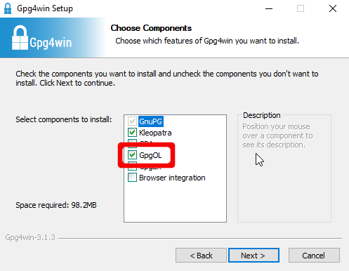
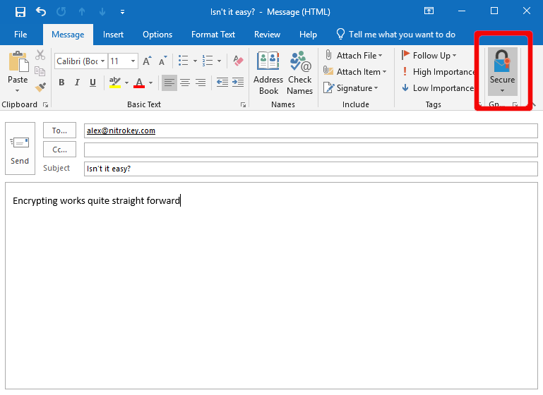
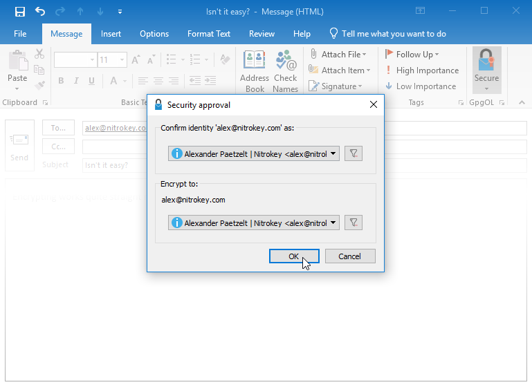
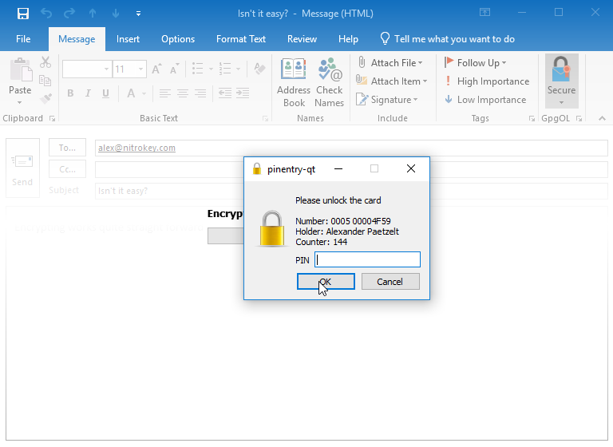

# OpenPGP Email Encryption with Outlook

::: tip Note
Unfortunately, there is no solution to use OpenPGP in Outlook for macOS yet.
:::

## Prerequisites

If you do not have PGP-Keys on your Nitrokey yet, please look at [this page](https://www.nitrokey.com/documentation/openpgp-email-encryption) first.

You need to have GnuPG installed on your System. The newest GnuPG version for Windows can be found [here](https://www.gpg4win.org). You need to make sure to have "GpgOL" checked during installation process (see below).

## Usage

After installing GPG4Win along with GpgOL, you will see a new icon labeled "Secure" in the composing window. To encrypt and sign a mail you just click on the sign like seen below.

     

GnuPG will start signing and encrypting the mail as soon as you click on 'send'. You are requested to choose the identity you want to sign with and encrypt for.

Furthermore, you are asked for typing in the User PIN of the Nitrokey for signing the mail.

You will be asked automatically for your User PIN if you want to read an encrypted mail.
