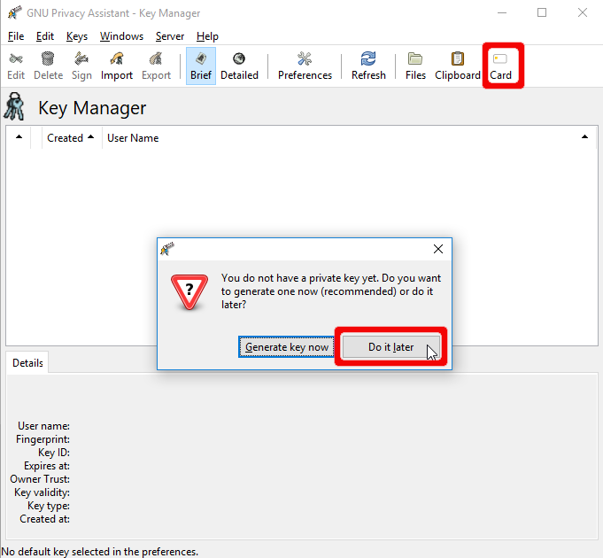
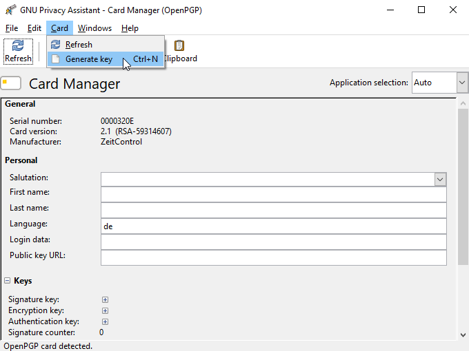
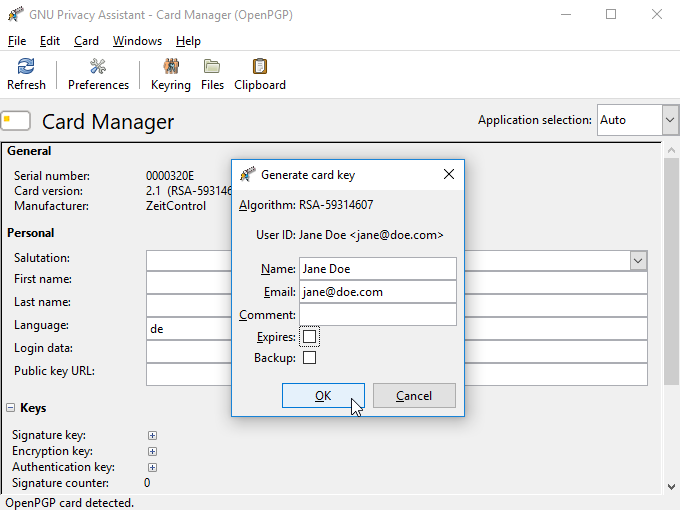
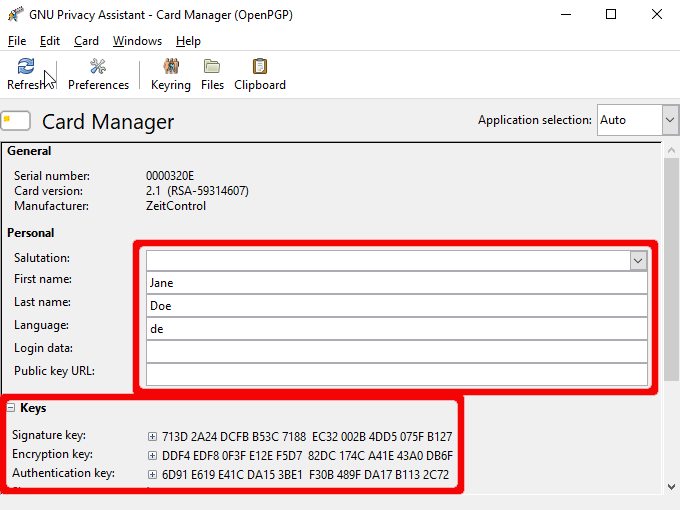
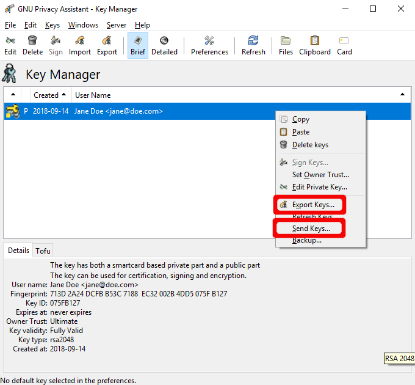
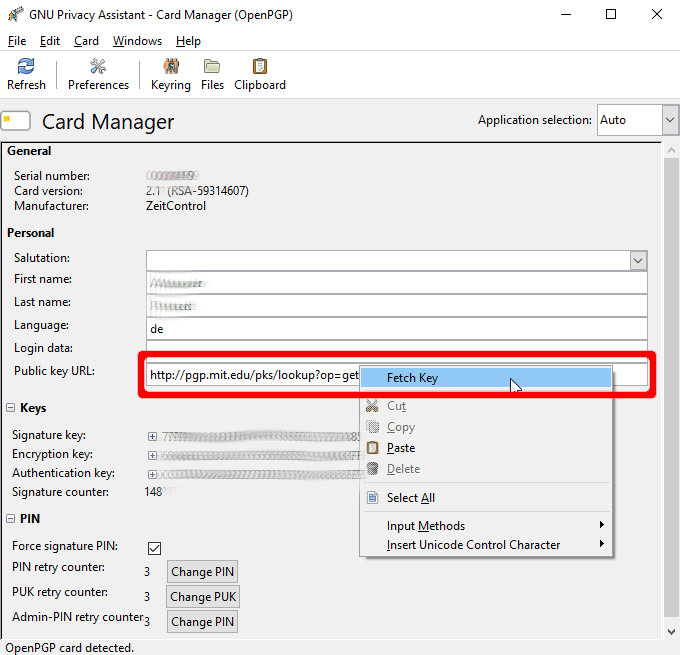

# OpenPGP Key Generation Using GPA

The following instructions explain the generation of OpenPGP keys directly on the Nitrokey with help of the GNU Privacy Assistant (GPA). You won't be able to create a backup of these keys. Thus, if you lose the Nitrokey or it breaks you can not decrypt mails or use these keys anymore. Please see [here](https://www.nitrokey.com/documentation/openpgp-email-encryption) for a comparison of the different methods to generate OpenPGP keys.

You need to have GnuPG and GPA installed on your system. The newest version for Windows can be found [here](https://www.gpg4win.org/) (make sure to check "GPA" during the installation!). Users of Linux systems please install GnuPG and GPA with help of the package manager (e.g. using `sudo apt install gnupg gpa` on Ubuntu).

::: tip Note
GPA does not exist for macOS. Therefore, please use [these instructions](https://www.nitrokey.com/documentation/openpgp-create-on-device) on macOS instead.
:::

## Key Generation

At first, open the GNU Privacy Assistant (GPA). You may are asked to generate a key, you can skip this step for now by clicking "Do it later". In the main window, please click on "Card" or "Card Manager".

Another windows opens. Please go to "Card" -> "Generate key" to start the key generation process.

Now you can put in your name and the email address you want to use for the key that will be generated next. You may choose an expiration date for your key, but you don't have to.

**Please do not use the backup checkbox**. This "backup" does only save the encryption key. In case of a loss of the device, you will not be able to restore the whole key set. So on the one hand it is no full backup (use [these instructions](https://www.nitrokey.com/documentation/openpgp-create-backup) instead, if you need one) and on the other hand you risk that someone else can get in possession of your encryption key. The advantage of generating keys on-device is to make sure that keys are stored securely. Therefore, we recommend to skip this half-backup.

You will be asked for the admin PIN (default: 12345678) and the user PIN (default: 123456). When the key generation is finished, you can see the fingerprints of the keys on the bottom of the window. You may fill up the fields shown above, which are saved on your Nitrokey as well.

Now you can close the window and go back to the main window. Your key will be visible in the key manager after refreshing. Every application which makes use of GnuPG will work with your Nitrokey as well, because GnuPG is fully aware of the fact, that the keys are stored on your Nitrokey.

## Exporting Public Key and Keyserver Usage

Although you can start to use your Nitrokey right away after generating the keys on your system, you need to import your public key on every system, you want to use the Nitrokey on. So to be prepared you have two options: You either save the public key anywhere you like and use it on another system or you save the public key on a webpage/keyserver.

Right-click on your key entry in the key manager and click "Export Keys..." to export the public key to a file and/or "Send Keys..." to upload the key to a keyserver.

You can carry the keyfile with you or send it to anyone who you like. This file is not secret at all. If you want to use the Nitrokey on another system, you first import this public key via clicking on "Keys" -> "Importing Keys..." and choosing the file.

If you do not want to carry a public keyfile with you, you can upload it to keyserver. If you are using another machine you can just import it by using "Server" -> "Retrieve Keys..." and entering your name or key id.

Another possibility is to change the URL setting on your card. Open the card manager again and fill in the URL where the key is situated (e.g. on the keyserver or on your webpage etc.). From now on you can import the key on another system by right-clicking on the URL and click on "Fetch Key".

