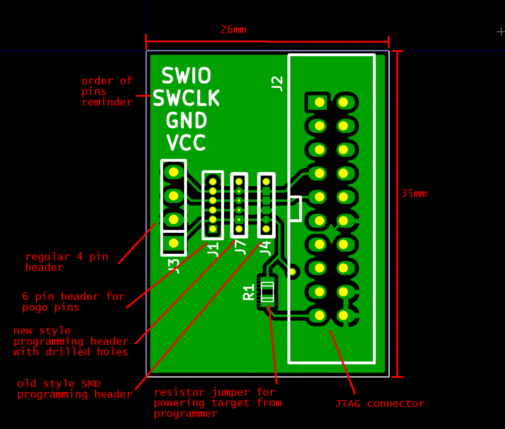

# Programming the Nitrokey

Nitrokey Pro, Start and HSM use the same hardware but different firmwares and different smart cards. The microprocessor being used is a [STM32F103R8T6](http://www.st.com/internet/mcu/product/164488.jsp). The firmware is written in C, the desktop software Nitrokey App is written in C/C++. You find all software sources and hardware layouts at [Github](https://github.com/nitrokey).

To develop the firmware of the Nitrokey Pro/Start/HSM you would need:

- An original Nitrokey Pro/Start/HSM or better a development board such as the [Olimex STM32-H103](https://www.olimex.com/Products/ARM/ST/STM32-H103/). Alternatively, get any other development board equipped with a STM32F103TB and 128KB flash. On request you can get a Nitrokey for development purposes from us.
- An [OpenPGP](https://www.assembla.com/wiki/show/cryptostick/OpenPGP) Card 2.1 available at [Kernel Concepts](http://shop.kernelconcepts.de/) or on request from us. (Of course, this is not necessary for Nitrokey Start which doesn't contain a smart card.)
If you use it with original Nitrokey hardware, you would need to cut it to Micro-SIM size. This can be done by using a special SIM card cutter or even with a scissor.
If you use a development board, you may solder the OpenPGP Card to the board directly by using some wires or you get yourself a smart card jack which you solder to the dev board instead.
- To compile the firmware we recommend [ARM's official GNU tools](https://launchpad.net/gcc-arm-embedded/).
- The microprocessor can be flashed with two different approaches:
    1. SWD is a STM-specific protocol and similar to JTAG allowing programming and debugging. Working adapters are Versaloon or any of the [ST-Link V2 (clones)](http://www.ebay.com/sch/i.html?_odkw=st-link&_osacat=0&_from=R40&_trksid=p2045573.m570.l1313.TR0.TRC0.H0.Xst-link+v2&_nkw=st-link+v2&_sacat=0). Under Linux you could give a patched [OpenOCD](https://github.com/snowcap-electronics/OpenOCD) a try but in the past it has been very troublesome. This approach requires to solder wires to the contact pads or to use an [adapter with pogo pins](https://github.com/Nitrokey/nitrokey-pro-hardware/tree/master/cs_pogo_adapter) and some kind of mounting (recommended).

    

    2. DFU is a simple protocol via serial port which allows programming but no debugging. On the Nitrokey hardware we expose the appropriate pins over the USB connector but it's not USB! Details are described in the next chapter.

## Flashing the Nitrokey Pro

Further information about flashing the device can be found at the [Github repository of the Nitrokey Pro](https://github.com/Nitrokey/nitrokey-pro-firmware).