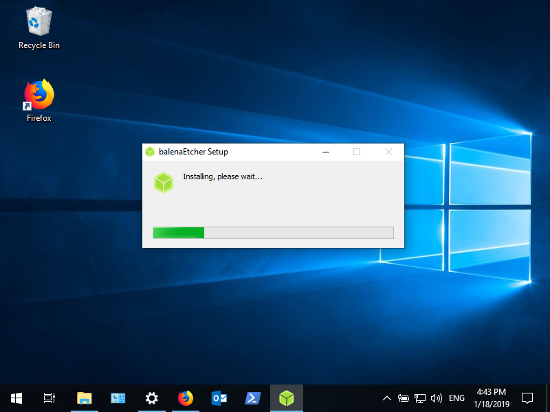
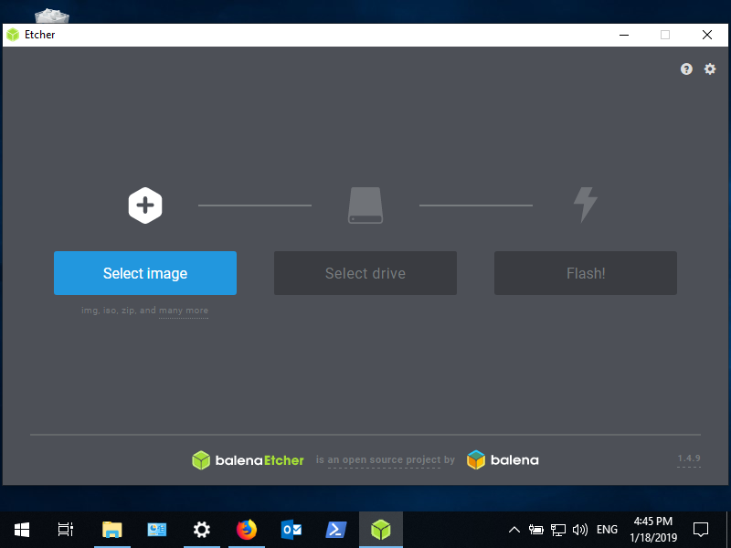
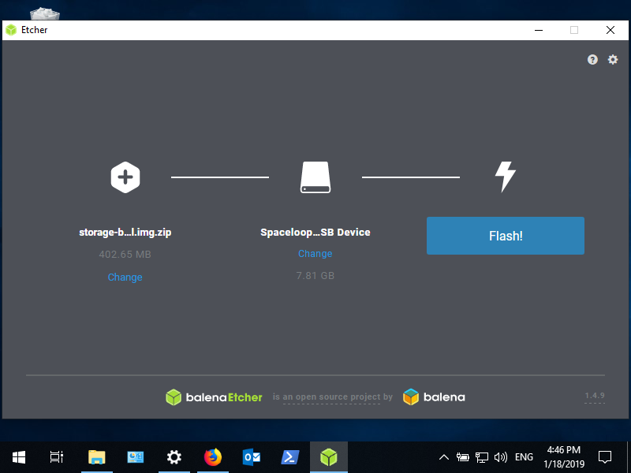
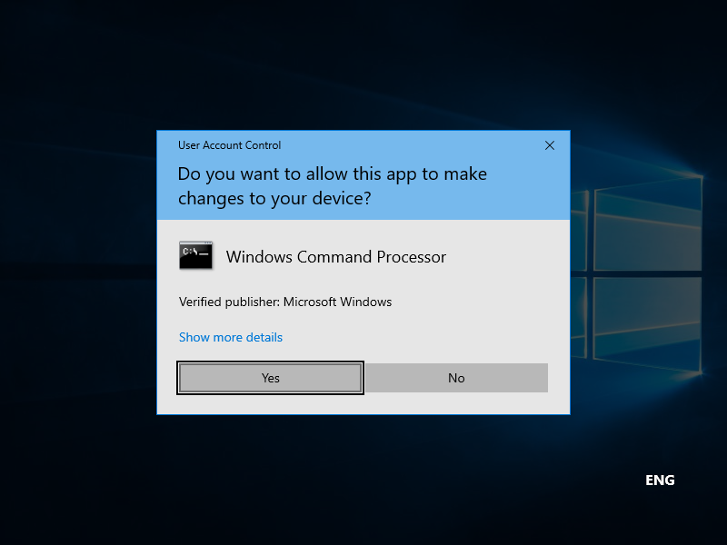
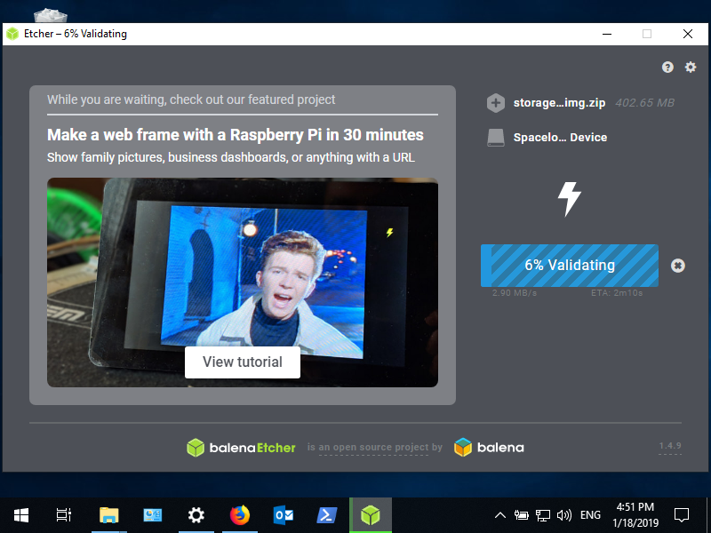
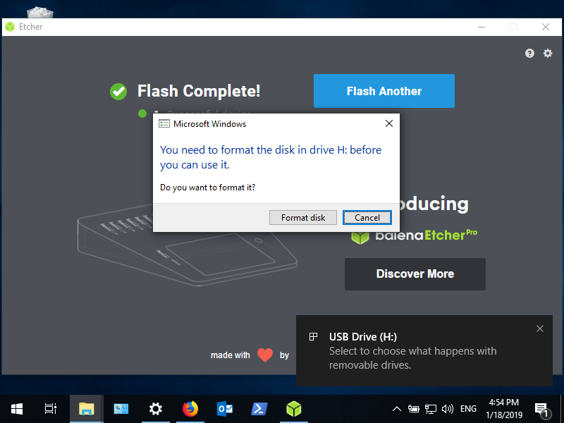
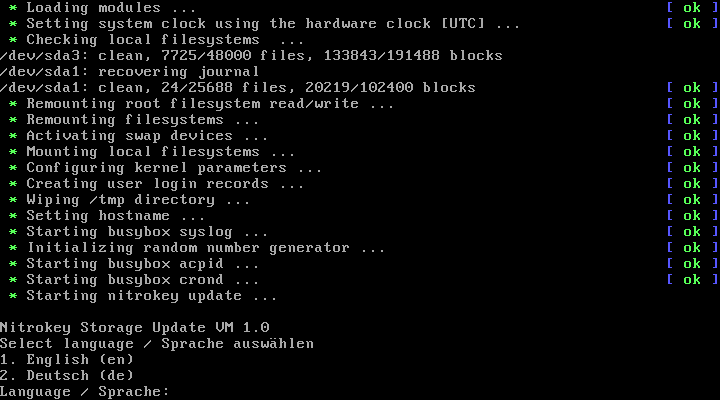
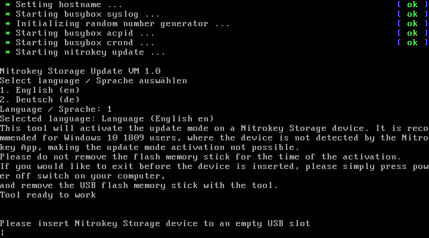
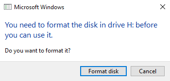

# Activate Update Mode Manually

**Note: The following steps are only necessary if you are using Windows 10 Build 1809 (or higher) and Nitrokey Storage with firmware 0.52 or older. In all other cases, or if you have access to another system, the regular update as described [here](https://www.nitrokey.com/en/documentation/firmware-update-storage) is sufficient and easier.**

## What is needed

To put the Nitrokey Storage manually into Update Mode (without using the Nitrokey App), the following is required:

- A USB stick (**All data on the USB stick will be lost! Please make a backup of the creation before!**)
- The "[Balena Etcher](https://www.balena.io/etcher/)" software
- The [USB Image](https://github.com/Nitrokey/nitrokey-storage-update-boot/releases/latest) we created for this purpose. Please download only the file ending with ".img.zip".

## Install Balena Etcher

Balena Etcher helps us to install the USB image on the USB stick. Please double click on the [previously downloaded installation file](https://www.balena.io/etcher/) and follow the instructions.

## Installing the USB image with Balena Etcher

The program usually opens immediately after installation. If not, you will find a shortcut on the desktop. Using the application, select the [previously downloaded image file](https://github.com/Nitrokey/nitrokey-storage-update-boot/releases), which ends with ".img.zip". Now insert the USB stick. It should be recognized automatically. Press "Flash!" to proceed.

You must allow the application to make changes.

After the image has been successfully transferred, Windows may ask if the device should be formatted. <ins>It is important that you click "Cancel", otherwise the USB stick will be overwritten by Windows.</ins>

## Booting from the USB stick

Now the system must be restarted. The USB stick must remain in the USB port so that the system can be started on the USB stick. Some devices are configured to start automatically from USB stick if it contains a system. If Windows instead of the USB image is booting right after the restart, you have to set your BIOS to boot from USB. On many systems this can be done with the Escape key, the F10, F11 or F12 key. Often, when starting the device there is also a hint which key to use the so-called "boot menu".

After the system has started, please choose the language by typing 1 (English) and hit Enter.

Please insert the Nitrokey Storage when asked to.

The Firmware Update Mode will be started automatically if the standard password is set. Otherwise you need to input your password and hit enter.

!

After the system has activated the firmware update on the Nitrokey Storage, a restart is issued after 60 seconds. Please remove the USB Stick. Afterwards you can use the Nitrokey Update Tool in Windows as described [here](https://www.nitrokey.com/en/documentation/firmware-update-storage).

## Restoring the USB Stick

Windows should automatically ask to format your USB Stick as soon as you insert the USB Stick the first time again in Windows. Just accept the request for being able to use the USB Stick as previously.

