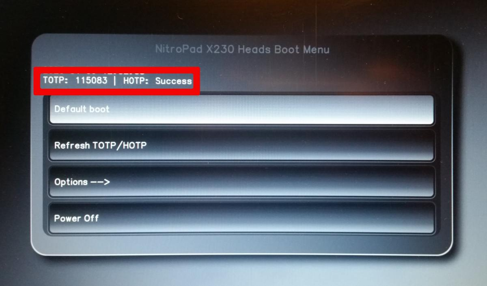
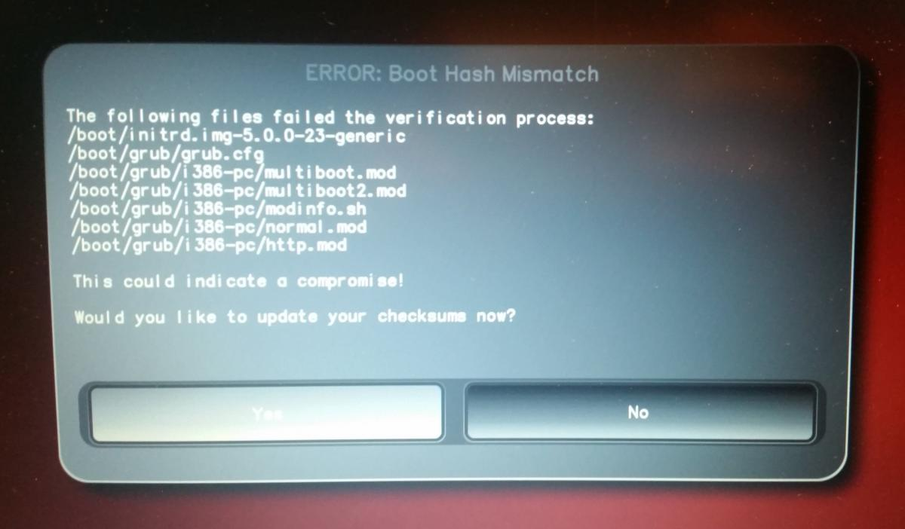
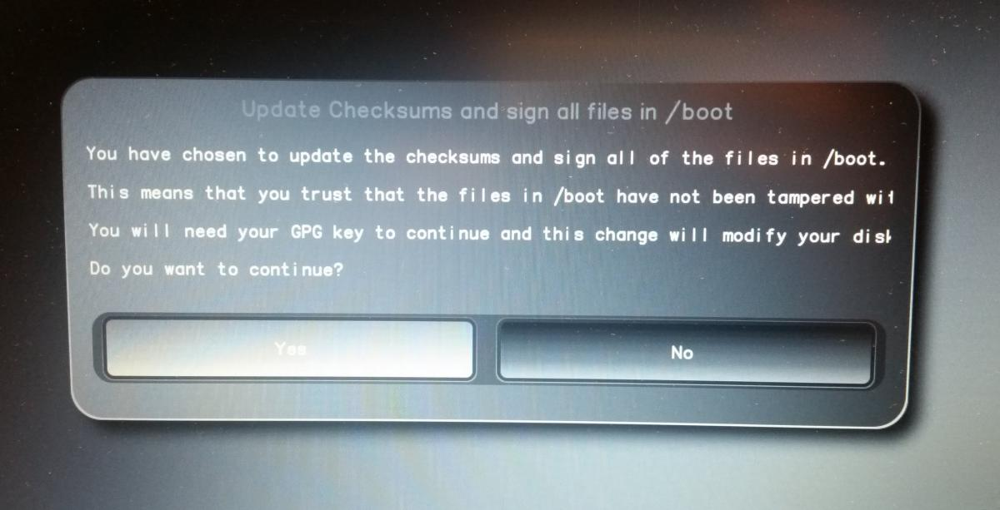
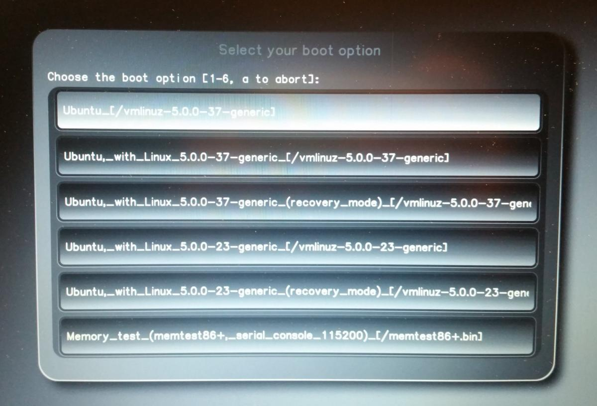

# Operating System Update

The NitroPad watches for changes to important system files to detect  third-party tampering. This means that special steps are sometimes  necessary when updating the system. This can often be recognized by the  fact that the system prompts you to reboot. In such, cases proceed as follows.

## Boot Hash Mismatch

1. If you restart the NitroPad after an update, the startup screen should initially appear as usual without an error message. 

2. If you press Enter afterwards, you will get an error message that looks like this or similar: 

3. Confirm the message with Enter to have the files changed by the  system update verified. Afterwards you will be asked again for a  confirmation. 

4. Now insert the Nitrokey if this is not already the case and  confirm with Enter. Then you must enter the User PIN of the Nitrokey.
   **Important**: Heads expects an English keyboard layout, on which e.g. "y" and "z" are swapped in comparison to the German keyboard layout. If you agree with  the default selection (which is written in capital letter) you can also  simply confirm by pressing Enter.
```
Please confirm that your GPG card is inserted [Y/n]:
 
Verifying presence of GPG card...
 
XXXXXXX: XXXXXXXXXX
Please unlock the card
 
Number: XXXX XXXXXX
Holder: 
Counter: X
PIN: 
```

Now the NitroPad marks the files changed by the update as verified.

## Boot Entry Has Changed

Next, either another error message appears or the operating system starts. This depends on the system update. If the following error message appears, proceeds as described below: 

1. Confirm the error message shown above by pressing Enter.
2. Then we see a list of all possible boat entries - choose the first one by simply pressing  Enter. 

3. To save this value as default, select the option "Make Ubuntu the  default" for Ubuntu or "Make Qubes the default" for Qubes OS in the next window. 

4. Now the Nitrokey has to be plugged in, if this is not yet the  case. Confirm the next three questions with Enter and enter the PIN of  the Nitrokey if prompted.
   **Important**: Heads expects an English keyboard layout, on which e.g. "y" and "z" are swapped in comparison to the German keyboard layout.

```
Saving a default will modify the disk. Proceed? [Y/n]:
 
Do you wish to add a disk encryption to the TPM [y/N]:
 
Please confirm that your GPG card is inserted [Y/n]:
 
Verifying presence of GPG card...
 
XXXXXXX: XXXXXXXXXX
Please unlock the card
 
Number: XXXX XXXXXX
Holder: 
Counter: X
PIN: 
```

5. Your system will then boot.