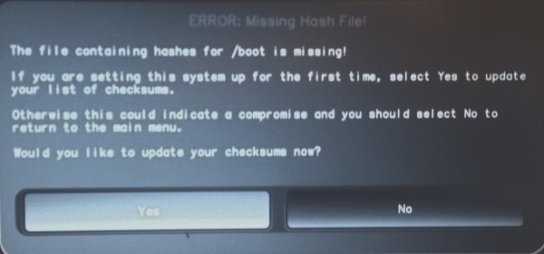
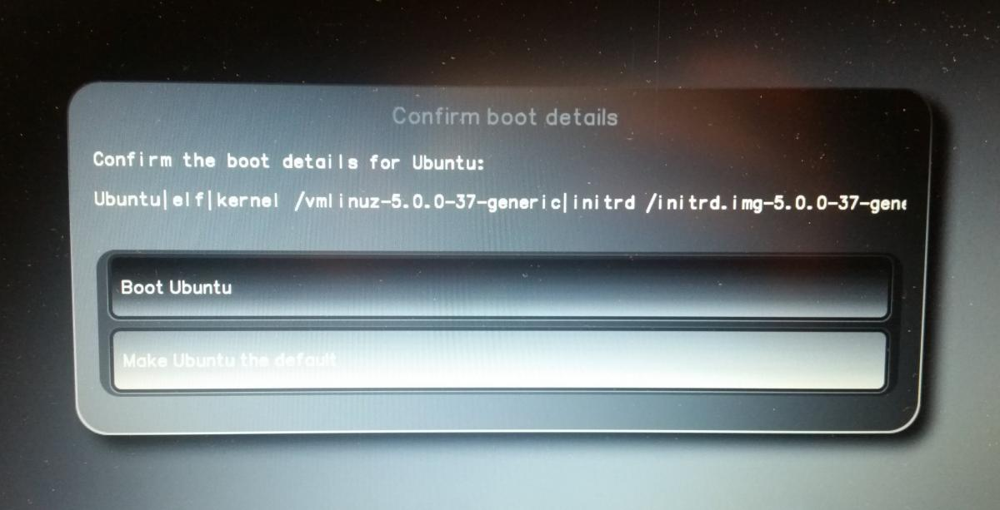

# Default Boot

If you have installed a new operating system, it may be that default boot is not yet assigned. If this is the case, please proceed as described below.

1. Select "Default boot".


2. Heads informs you that it does not yet know any default. First you agree to the update of the checksums.



3. Confirm the process with Enter.


4. Now insert the Nitrokey if this is not already the case and confirm with Enter. Then you have to enter the User PIN of the Nitrokey.

```
    Please confirm that your GPG card is inserted [Y/n]:

    Verifying presence of GPG card...

    XXXXXXX: XXXXXXXXXX
    Please unlock the card

    Number: XXXX XXXXXX
    Holder: 
    Counter: X
    PIN: 
```

Now the NitroPad marks the files that changed by the update as verified.

5. Confirm the process with Enter.


6. You will then see a list of all possible boot entries - choose the first one here by simply pressing Enter.
    Boot Options


7. To save this value as default, select "Make Ubuntu the default" for Ubuntu or "Make Qubes the default" for Qubes OS.
    Confirm Boot Details



8. Confirm the next three questions with Enter and enter the PIN of the Nitrokey if you are prompted to do so.

```
    Saving a default will modify the disk. Proceed? [Y/n]:

    Do you wish to add a disk encryption to the TPM [Y/n]:

    Please confirm that your GPG card is inserted [Y/n]:

    Verifying presence of GPG card...

    XXXXXXX: XXXXXXXXXX
    Please unlock the card

    Number: XXXX XXXXXX
    Holder: 
    Counter: X
    PIN:
```
9. Your system will then boot.


## Changing default kernel
This is a workaround for Heads v1.1 bug, which does not allow to change the kernel to the one later (lower) in the list.

Usual way would be to go to `Options -> Boot Options -> Show OS boot menu`, selecting the kernel and making it default, however the latter is not working at the moment. Instead please use the following workaround:


1. Start recovery console and remove the default boot files. Please make sure the correct files are removed. Here 2 default files were available:
```
$ cd /
$ mount -o remount,rw /boot
$ ls /boot/kexec_default.*.txt
kexec_default.1.txt kexec_default.2.txt
$ rm /boot/kexec_default.*.txt -v
removed '/boot/kexec_default.1.txt'
removed '/boot/kexec_default.2.txt'
$ reboot
```
2. Sign all current boot files with:
`Options --> Update checksums and sign all files in /boot`
3. Return to main menu and select default boot
`Main Menu --> Default boot`
3. Agree to select default kernel (screen: `No Default Boot Option Configured` )
4. Select the desired kernel to work as the default
4. Select 2nd option: `Make <kernel version> the default` 
5. Save the kernel with accepting default options (proceed, do not agree for TPM encryption, confirm GPG card):
```
Saving... Proceed (Y/n): Y
Do you wish... to the TPM (y/N): N
Please confirm... inserted (Y/n): Y
```
6. Enter PIN for the Nitrokey Pro/Storage device to execute signing process
7. The selected kernel will boot and it will be the default one the next time when selecting `Default Boot` option from the menu.