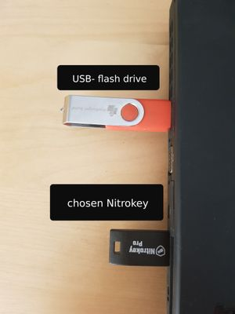
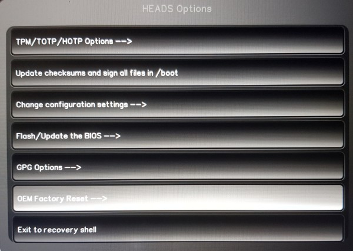
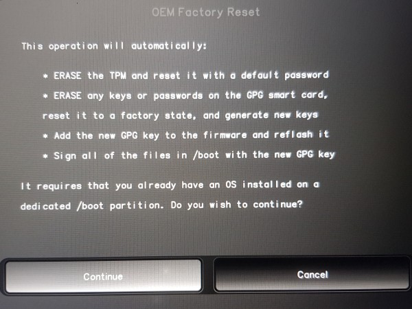
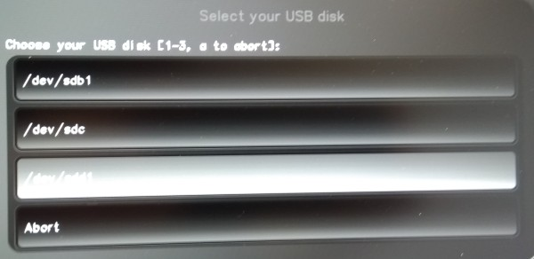
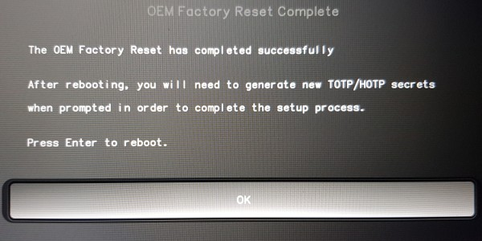
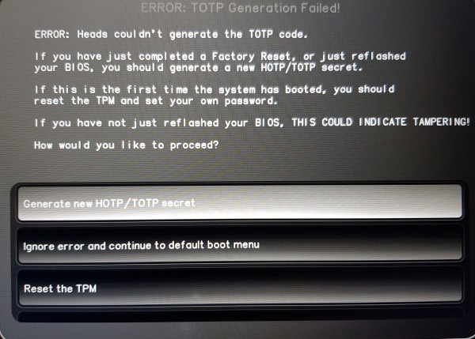
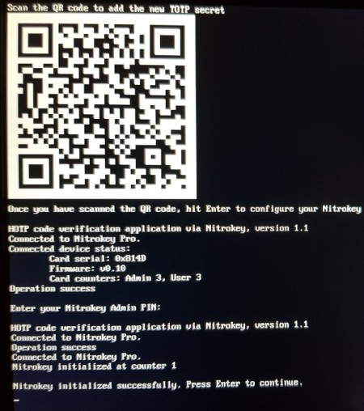
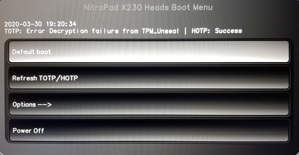

# Factory Reset

### Reasons for resetting to factory settings

- Your Nitrokey is locked (e.g. due to multiple incorrect PIN entries)
- You have installed an operating system yourself (e.g. after changing the hard disk)
- Your operating system does not start

### Procedure

1. Connect any USB flash drive to the NitroPad. (You need that USB flash drive for saving your security key)
2. Connect your Nitrokey to the NitroPad.



3. Turn on the NitroPad.
4. Select "Options".


5. Select "OEM-Factory Reset".



6. Confirm the "OEM Factory Reset" with "Continue".



7. You will be asked if you want to set the User and Admin/TPM PIN yourself. You press Enter to continue without changing the PINs.

8. You will then be asked if manual user information should be added. You confirm with 'y' and enter your name and then the email address.

```
Would you like to set a costum password?[y/N]: 
Would you like to set costum user Information for the GnPG key?[y/N]: y 
Please enter the following Information... 

Real name: "your name" 
Email adress: "your email-adress" 
Comment: 

Checking for USB media... 

New value of PCR[5]: xxxxxxxxxxxxxxxxxxxxxxxxxxxxxxxxxxxxxxxxxxxxxxxxxxx 
[ xx.xxxxxx] sd 6:0:0:0: [sdb] No Caching mode page found 
[ xx.xxxxxx] sd 6:0:0:0: [sdb] Assuming drive cache: write through 

Checking for GPG Key... 

Detecting and setting boot device... 

Boot device set to /dev/sda1 

Resetting TPM... 

Resetting GPG Key... 
(this will take a minute or two)
```
9. If you are using Nitrokey storage, you must then select the drive. If the drives /dev/sdb1, /dev/sdc, /dev/sdd1 are displayed, select /dev/sdd1. If the drives /dev/sdb1, /dev/sdc1, /dev/sdd are displayed, select /dev/sdb1.




10. The rest of the configuration will be done automatically. You confirm the subsequent restart.



11. After the restart the OTP secret must be created. Confirm the process with Enter.



12. Confirm that new OTP Secrets should be created.


13. When prompted, enter the Admin PIN and TPM password. Both are by default: "12345678".

   

14. You should then reach the Start menu.



15. Press Enter to start the "Default Boot".                                                            
::: tip NOTE
If you see the message that no default exists yet, please follow the procedure described in "Troubleshooting: Default Boot Menu".
:::

16. Once the operating system starts until the encryption password is requested, you are done.


17. Finally, copy the public PGP key from the data stick to your computer, e.g. to use it for e-mail encryption.


